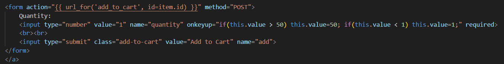
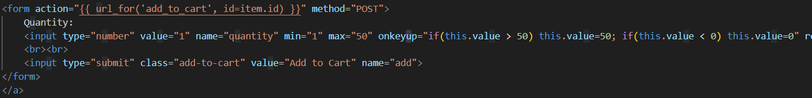

- Nesta imagem podemos ver que os limites numéricos são definidos através do evento “onekeyup”, que substitui os valores inseridos pelo utilizador caso ultrapassem os limites.

- O evento é uma medida de segurança muito fraca pois não reage à inserção indireta dos valores, sempre que ocorra um erro onde se possa colocar os números fora dos limites não há proteção para o prevenir.

- Para corrigir o erro basta adicionar os atributos “max” e “min” na mesma linha definindo os limites de uma forma muito mais segura, já que se torna impossível colocar números fora deles, sejam inseridos diretamente ou indiretamente.