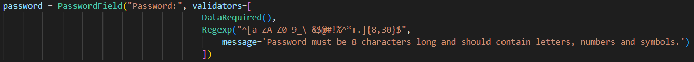
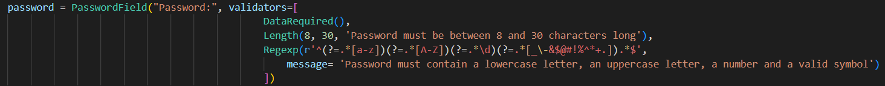

# CWE - 521 (Weak Password Requirements)

Esta vulnerabilidade faz com que passwords sejam particularmente suscetíveis a brute force e dictionary attacks.

Na versão insegura a password tem que ter entre 8 e 30 caracteres, o que não são requisitos suficientes para estar protegida.

Para resolver isto na versão segura, temos como requisitos que a palavra-passe tenha entre 8 e 30 caracteres e pelo menos 1 letra minúscula, 1 letra maiúscula, 1 número e 1 símbolo válido.

Podia-se aplicar mais requisitos como a password ser distinta de x passwords presentes num text file, não haver caracteres sequenciais e não ter caracteres repetidos, por exemplo. No entanto, pensamos que os requisitos apresentados na versão segura já são suficientes para demonstrar o nosso conhecimento desta vulnerabilidade 

## Unsafe version

## Safe version

