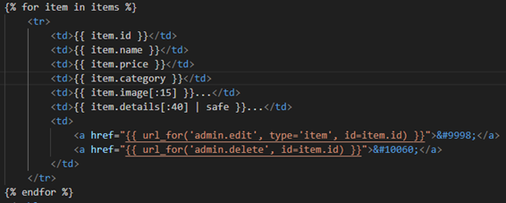
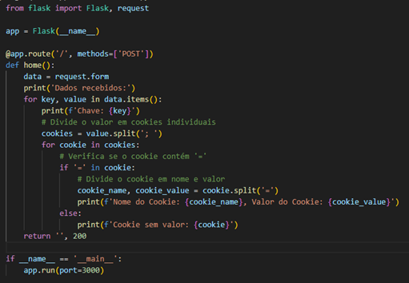
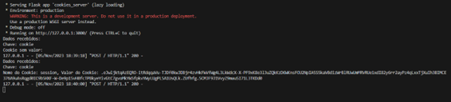

- Cada vez que um utilizador abre o produto "DETI Phone Case" o script é executado e os cookies da sessão atual são enviados para um servidor.

- O template items.html é responsável por mostrar a página com as informações do produto, a descrição do item é renderizada sem ser escapada devido ao uso do filtro safe do Jinja2.

- Isto significa que qualquer script incluído na descrição do item será executado quando a página for carregada. Além disso, o roubo dos cookies é facilitado pois a configuração SESSION_COOKIE_HTTPONLY está definida como False.

- O servidor cookies_server está à escuta pronto para receber o cookie, para sequestrar a sessão do usuário. Isso pode assim permitir a realização de ações em nome do usuário.

- Exemplo: 

- Para mitigar este problema devem ser tomar algumas medidas como: escapar adequadamente a saída para evitar a injeção de scripts, definir SESSION_COOKIE_HTTPONLY como True.