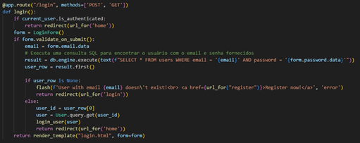
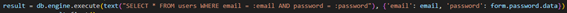
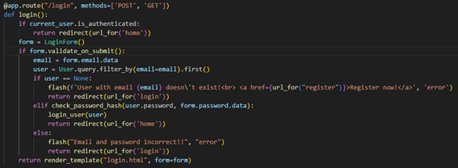

- Esta é a função de código que está responsável por validar/autenticar um novo utilizador, no entanto, é vulnerável a ataques de injeção SQL devido à forma como a consulta SQL está construída.

- Se introduzirmos um email válido no formato “email’ –” a consulta SQL torna-se "SELECT * FROM users WHERE email = 'email' -- AND password = ''". O “--” em SQL é um comentário, então tudo após isso é ignorado. 

- Na nossa versão corrigida optamos por usar outra alternativa que foi usar a biblioteca ORM (Object-Relational Mapping) SQLAlchemy.

- A diferença nesta versão está então na maneira como o user é obtido, feito através de uma consulta ao banco de dados usando o método filter_by() que escapa automaticamente os dados de entrada.