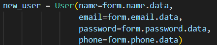
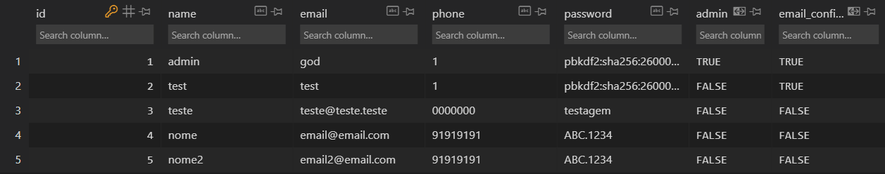
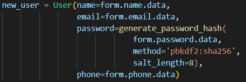
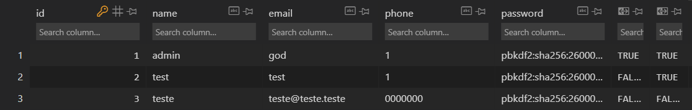

# CWE-256 (Plaintext Storage of a Password)

Esta vulnerabilidade permite a obtenção de passwords de contas existentes no website.

A situação é ainda mais agravada caso existam utilizadores com permissões de admin suscetíveis a esta vulnerabilidade. Um atacante com essa conta compromete todo o website e sistema por trás deste.

Para a resolver basta cifrar a password antes desta ser guardada numa base de dados.

Foi usada a função de hash sha256 e um salt de 8 caracteres.

## Unsafe version

## Safe version

