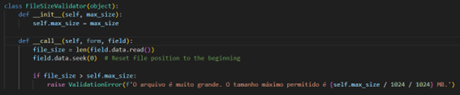

# Issue 12.1.1 - Verify that the application will not accept large files that could fill up storage or cause a denial of service.

Os usuários poderiam fazer upload de arquivos de qualquer tamanho, o que poderia preencher o armazenamento ou causar uma negação de serviço (DoS).

Agora, o sistema verifica o tamanho do arquivo antes de aceitar o upload. Se o arquivo for muito grande, o sistema recusará o upload e enviará uma mensagem de erro ao usuário.

Se o tamanho do arquivo exceder o tamanho máximo permitido (definido no construtor do validador), ele levanta uma ValidationError, que pode ser capturada e tratada para informar ao usuário que o arquivo é muito grande.

## Code

