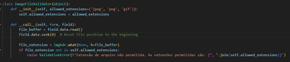

# Issue 12.3.4 - Verify that the application protects against Reflective File Download (RFD) by validating or ignoring user-submitted filenames in a JSON, JSONP, or URL parameter, the response Content-Type header should be set to text/plain, and the Content-Disposition header should have a fixed filename.

O sistema de upload de imagens não tinha nenhuma verificação de nomes de arquivos enviados pelo usuário.

Após a correção da issue de RFD, o sistema agora valida ou ignora os nomes de arquivos enviados pelo usuário. Isso é feito através da implementação de uma função de validação que verifica o nome do arquivo antes de aceitar o upload.

Além disso, o sistema agora define o cabeçalho Content-Type da resposta para text/plain e o cabeçalho Content-Disposition para ter um nome de arquivo fixo.

## Code

