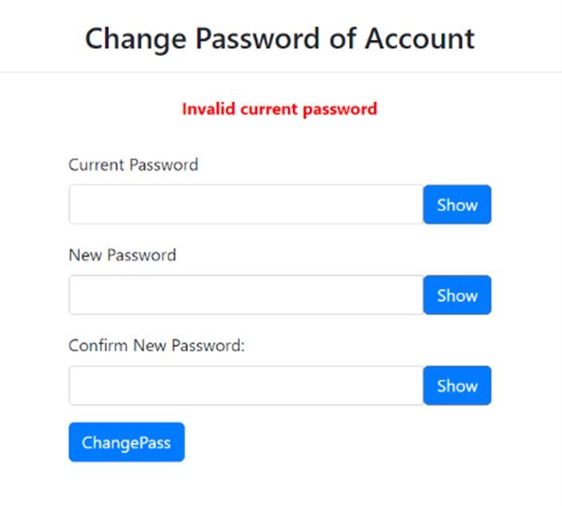

# Issue 2.1.5 - Verify users can change their password

Teve que se alterar o base.html para incluir no dropdown a opção de Change Password, bem como adicionar uma nova página html change_pass.html.

Caso a password antiga corresponda à existente na base de dados e a password nova cumpra os requisitos de passwords do site, ocorre a alteração. Em caso contrário, recusa-se a alterar.

## Code

