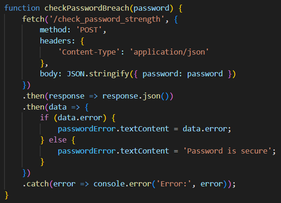
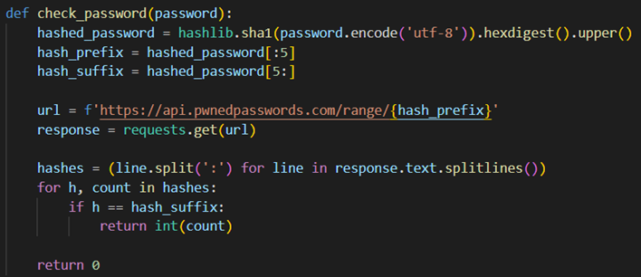

# Issue 2.1.7 - Verify that passwords submitted during account registration, login, and password change are checked against a set of breached passwords either locally or using an external API.

Sem a resolução deste issue, passwords como “Password1234” eram permitidas. Ataques de dicionário facilmente obtém este tipo de passwords.

Num ponto de vista de implementação usou-se a API Have I Been Pwned que verifica se uma password já foi indevidamente obtida anteriormente. Se sim, a password não é permitida no site. Caso contrário, passa nesta verificação e pode ser uma password passando os restantes requisitos.

## Code

