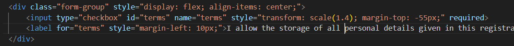

# Issue 8.3.3 - Clear language is used regarding personal information and users have provided opt-in consent

 Na página de registo existe uma checkbox que indica a informação essencial sobre como os dados do utilizador são guardados.

Na página onde a conta pode ser apagada também são apresentadas as informações do utilizador, com exceção da palavra-passe e das encomendas por serem dados críticos.

## Code

